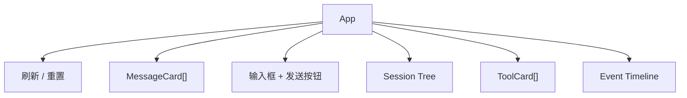

# Step 6：React 前端

前端不是 Agent 的核心，但它能把核心机制变得可观察。教学版页面有四个区域：聊天、Session Tree、工具列表、事件时间线。

对应文件：

```text
examples/teaching-agent/src/client/App.tsx
examples/teaching-agent/src/client/styles.css
```

## 本节新增文件

```text
index.html
src/client/main.tsx
src/client/App.tsx
src/client/styles.css
public/favicon.svg
```

本节的目标是让 Agent 内部状态变得可观察：消息、工具、事件都要看得见。界面不必花哨。

## 页面结构



这个布局的教学目的很明确：

| 区域 | 让读者观察什么 |
| --- | --- |
| 聊天区 | user、assistant、toolResult 都是消息 |
| Session Tree | `id` / `parentId` 如何形成分支，当前 `leafId` 在哪里 |
| 工具列表 | 当前 Agent 有哪些可调用能力 |
| 事件时间线 | 一次 prompt 的内部生命周期 |

## 数据流

```ts
const [session, setSession] = useState<SessionResponse>(EMPTY_SESSION);

async function refresh() {
  const response = await fetch("/api/session");
  setSession(await response.json());
}
```

发送消息时：

```ts
const response = await fetch("/api/runs", {
  method: "POST",
  headers: { "Content-Type": "application/json" },
  body: JSON.stringify({ text }),
});
const { runId } = await response.json();
const source = new EventSource(`/api/runs/${runId}/events`);
```

完整仓库已经使用 SSE：`message_start/update/end` 会增量更新聊天区，`tool_execution_start/end` 和 `tool_permission` 会进入事件时间线，最后 `run_done` 用完整 session 对齐最终状态。

::: tip 跟做建议
如果你从空目录第一次实现，可以先用 `POST /api/prompt` 一次性返回 JSON，让页面跑起来；再按完整仓库把提交逻辑升级成 `/api/runs` + SSE。这样学习曲线更平。
:::

## 最小可运行页面

先写 `src/client/main.tsx`：

```tsx
import { createRoot } from "react-dom/client";
import { App } from "./App";
import "./styles.css";

createRoot(document.getElementById("root")!).render(<App />);
```

再写一个最小 `App`：

```tsx
export function App() {
  const [session, setSession] = useState<SessionResponse>(EMPTY_SESSION);
  const [input, setInput] = useState("列出工作区文件");

  async function submit(event: FormEvent) {
    event.preventDefault();
    // 跟做最小版可以先用 /api/prompt；完整仓库默认走 /api/runs + SSE。
    const response = await fetch("/api/prompt", {
      method: "POST",
      headers: { "Content-Type": "application/json" },
      body: JSON.stringify({ text: input }),
    });
    setSession(await response.json());
  }

  return (
    <main>
      {session.messages.map((message, index) => (
        <pre key={index}>{JSON.stringify(message, null, 2)}</pre>
      ))}
      <form onSubmit={submit}>
        <input value={input} onChange={(event) => setInput(event.target.value)} />
        <button>发送</button>
      </form>
    </main>
  );
}
```

等数据流跑通后，再替换成仓库里的精致版组件：`MessageCard`、`ToolCard`、`Event Timeline`。

## MessageCard

assistant message 需要特殊处理 tool call：

```tsx
message.content.map((block) =>
  block.type === "toolCall" ? (
    <ToolCallBlock block={block} />
  ) : (
    <p>{block.text}</p>
  ),
)
```

这是前端层面再次提醒读者：assistant message 不是字符串。

## Event Timeline

```ts
function summarizeEvents(events: AgentEvent[]): string[] {
  return events.slice(-80).map((event) => {
    switch (event.type) {
      case "tool_execution_start":
        return `tool_start: ${event.toolName}`;
      case "tool_execution_end":
        return `tool_end: ${event.toolName}${event.isError ? " error" : ""}`;
      case "compaction":
        return `compaction: ${event.tokensBefore} approx tokens`;
      default:
        return event.type;
    }
  });
}
```

真实产品里，这里可以变成更完整的调试面板：耗时、参数、输出摘要、token 用量、错误栈。

## 移动端注意点

教学版 CSS 做了两件事：

1. 桌面端左右布局，聊天在左，工具和事件在右。
2. 移动端单列布局，避免输入框和时间线挤压。

Agent UI 里最容易出问题的是动态内容：工具参数、长文件名、错误日志。样式里要允许换行和滚动，不要让一段 JSON 撑破页面。

## 运行检查

```bash
npm run teaching-agent:dev
```

打开：

```text
http://localhost:5174/
```

依次输入：

```text
列出工作区文件
读取 agent-notes.md
写一条笔记
```

你应该能看到工具调用卡片和事件时间线同步变化。

预期页面至少能显示：

```text
user: 列出工作区文件
assistant: list_files toolCall
tool:list_files: README.md / agent-notes.md
assistant: 我已经列出工作区文件...
```

## 常见错误

| 错误 | 后果 |
| --- | --- |
| 只展示 assistant 文本 | 看不到 tool call，读者误以为模型直接读了文件 |
| loading 时不禁用按钮 | 容易发起并发 prompt/reset |
| 时间线只展示最终状态 | 读者看不到 loop 内部过程 |
| 移动端固定两列 | 390px 视口内容溢出 |

## 小练习

给 `ToolCallBlock` 增加一个折叠按钮，默认只显示工具名，展开后显示 JSON 参数。这个练习能让你处理真实 Agent UI 里常见的“结构化内容太长”问题。

## 本节 checkpoint

```bash
git add index.html src/client public
git commit -m "step 6: add teaching agent ui"
```
